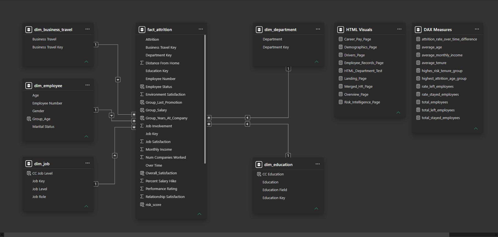

# 👥 HR ATTRITION ANALYTICS — POWER BI

> **Workforce Analytics | Employee Attrition | Risk Intelligence**

**HR Attrition Analytics** is an interactive **Power BI Business Intelligence solution** developed as part of the **GBS BI HUB – BI Developer HR Attrition Case Study**.

The project transforms employee-level data into an analytical experience covering **attrition, workforce demographics, career progression, compensation, employee drivers, and retention risk**. It combines data preparation, dimensional modeling, DAX, Power Query, Figma-based UI/UX design, and custom HTML/CSS visuals inside Power BI.

---

## 🖼️ Dashboard Experience

The report is structured as a guided analytical journey:

**Landing → Overview → Driver → Demographic → Career & Pay → Risk Intelligence**

### 01 — Landing

<p align="center"></p>

The entry point to the report, designed to introduce the solution and provide navigation into the analytical sections.

### 02 — Overview

<p align="center"></p>

Executive-level workforce and attrition overview, bringing together core KPIs and high-level workforce patterns.

### 03 — Driver

<p align="center"></p>

Explores factors associated with employee attrition, including overtime, business travel, job characteristics, and employee experience indicators.

### 04 — Demographic

<p align="center"></p>

Analyzes attrition across demographic and organizational segments.

### 05 — Career & Pay

<p align="center"></p>

Examines compensation, job level, tenure, career progression, and related workforce characteristics.

### 06 — Risk Intelligence

The Risk Intelligence section contains five analytical views:

<p align="center"></p>
<p align="center"></p>
<p align="center"></p>
<p align="center"></p>
<p align="center"></p>

These views are designed to move from workforce-level attrition analysis toward **employee retention risk investigation**.

### Data Model

<p align="center"></p>

The model uses a **Snowflake-style dimensional structure** with an employee-level attrition fact table connected to descriptive dimensions.

---

## 🎯 Project Objective

The objective is to understand **where attrition is concentrated, which employee segments show elevated turnover, and which workforce factors deserve further investigation**.

The solution addresses questions such as:

- How many employees have left the organization?
- What is the overall attrition rate?
- Which departments and job roles have higher attrition?
- How does overtime relate to employee turnover?
- Does business travel show different attrition patterns?
- How do compensation and satisfaction differ between employees who stayed and those who left?
- How do career progression and tenure relate to attrition?
- Which workforce segments should HR investigate further?

The dashboard is designed for **exploration and investigation**, not simply KPI display.

---

## 📊 Data at a Glance

The repository contains a structured analytical dataset with **6 Excel tables**:

| Type | Tables | Count |
|---|---|---:|
| 📐 Dimensions | Business Travel, Department, Education, Employee, Job | **5** |
| 📊 Fact | Employee Attrition | **1** |
| 🗂️ Total analytical tables | Dimensions + Fact | **6** |

### Dataset Structure

| Table | Role |
|---|---|
| `fact_attrition.xlsx` | Employee-level attrition and analytical measures |
| `dim_employee.xlsx` | Employee demographic attributes |
| `dim_business_travel.xlsx` | Business travel categories |
| `dim_department.xlsx` | Department attributes |
| `dim_education.xlsx` | Education and education-field attributes |
| `dim_job.xlsx` | Job level and job role attributes |

The analytical dataset contains **1,470 employee records and 35 source attributes**.

---

## 🔄 End-to-End BI Workflow

```
Raw Employee Data
        ↓
Data Exploration
        ↓
Power Query Transformation
        ↓
Dimensional Data Model
        ↓
DAX Measures & Calculations
        ↓
Power BI Analytics
        ↓
Interactive Dashboard
        ↓
Attrition & Risk Intelligence
```

### Power Query

Power Query was used to:

- Promote headers
- Rename fields into business-friendly names
- Apply appropriate data types
- Merge source data with dimension tables
- Add dimension keys
- Remove redundant attributes
- Prepare the final analytical model

Examples include:

```
BusinessTravel      → Business Travel
DailyRate           → Daily Rate
DistanceFromHome    → Distance From Home
EmployeeNumber      → Employee Number
MonthlyIncome       → Monthly Income
OverTime            → Over Time
TotalWorkingYears   → Total Working Years
YearsAtCompany      → Years At Company
```

### DAX

DAX was used to create dynamic KPIs, employee classifications, satisfaction calculations, analytical rankings, and custom HTML/CSS content.

---

## 🗂️ Data Model

The project uses a **Snowflake-style dimensional model** centered around `FACT_Atrition`.

### Fact Table

**FACT_Atrition**

Contains employee-level analytical attributes such as:

- Employee Number
- Attrition
- Monthly Income
- Distance From Home
- Percent Salary Hike
- Total Working Years
- Years At Company
- Years In Current Role
- Years Since Last Promotion
- Years With Current Manager
- Training Times Last Year
- Satisfaction metrics
- Performance Rating
- Overtime
- Stock Option Level

### Dimension Tables

**DIM_Employee**
- Employee Number
- Age
- Gender
- Marital Status

**DIM_Business Travel**
- Business Travel Key
- Business Travel

**DIM_Department**
- Department Key
- Department

**DIM_Education**
- Education Key
- Education
- Education Field

**DIM_Job**
- Job Key
- Job Level
- Job Role

### Model Flow

```
DIM_Employee
       │
DIM_Business Travel
       │
DIM_Department ───► FACT_Atrition
       │
DIM_Education
       │
DIM_Job
```

This structure separates descriptive attributes from employee-level analytical data and provides a reusable foundation for Power BI reporting.

---

## 📐 Core KPIs

The semantic model contains dedicated measures for workforce and attrition analysis:

| KPI | Purpose |
|---|---|
| **Count Employees** | Total employee population |
| **Count Employees Left** | Employees with Attrition = Yes |
| **Employees Left %** | Overall attrition rate |
| **Count Employees Stay** | Employees with Attrition = No |
| **Count Employees Works Over Time** | Employees working overtime |
| **Count Employees Works Over Time %** | Overtime workforce percentage |
| **AVG Monthly Salary** | Average monthly income |
| **AVG Overall Satisfaction** | Average employee satisfaction |
| **AVG Employee Performance** | Average performance rating |
| **AVG Distance From Home** | Average employee distance from home |

### Example DAX

```DAX
Employees Left % =
DIVIDE(
    [Count Employees Left],
    [Count Employees]
)
```

An overall satisfaction score is also calculated from four employee-experience measures:

```DAX
CC Overall Satisfaction =
DIVIDE(
    FACT_Atrition[Environment Satisfaction]
        + FACT_Atrition[Job Satisfaction]
        + FACT_Atrition[Relationship Satisfaction]
        + FACT_Atrition[Work Life Balance],
    4
)
```

---

## 🔎 Business Analysis

### Attrition Overview

The dataset contains **1,470 employees**, including **237 employees who left**, corresponding to an overall attrition rate of approximately **16.1%**.

### Overtime

Employees working overtime show a substantially different attrition pattern from employees who do not work overtime. This makes overtime an important dimension for HR investigation.

### Business Travel

Frequent business travel also shows a different attrition pattern from employees who do not travel. Travel intensity can therefore be analyzed alongside workload and work-life balance.

### Job Role

Attrition is not evenly distributed across job roles. Role-level analysis helps identify workforce segments that warrant deeper investigation.

### Compensation

Employees who left have a lower average monthly income than employees who stayed in this dataset. Compensation should therefore be examined together with job level, tenure, role, and satisfaction rather than treated as an isolated explanation.

### Career & Pay

Career progression, years at company, years in current role, years since promotion, job level, and monthly income provide additional context for understanding employee retention patterns.

> **Important:** These are observed associations in the dataset. They should not be interpreted as proof that a specific factor causes attrition.

---

## 🧠 Risk Intelligence

The Risk Intelligence section extends the analysis beyond descriptive HR reporting.

It is designed to help users investigate:

- Employee segments with elevated attrition
- Workforce characteristics associated with turnover
- Overtime and workload patterns
- Business travel exposure
- Career progression
- Compensation
- Satisfaction
- Job and organizational context

The objective is to create a structured path from **What happened? → Where is it concentrated? → What factors should be investigated?**

---

## 🎨 Dashboard Design & UX

The project combines analytics with a deliberate UI/UX workflow.

### Figma

Figma was used to:

- Plan page layouts
- Establish visual hierarchy
- Design UI components
- Refine spacing and alignment
- Build a consistent visual language
- Plan navigation before Power BI implementation

### Custom HTML/CSS

DAX-generated **HTML/CSS** was used to create customized Power BI content, particularly for employee-level presentation.

This demonstrates how Power BI can be extended beyond its standard visual library by combining:

**DAX + HTML + CSS + Power BI**

---

## 🛠️ Technology Stack

| Technology | Role |
|---|---|
| 📊 **Power BI Desktop** | Data modeling, visualization, navigation, and dashboard development |
| 🔄 **Power Query** | Data transformation and preparation |
| 🧮 **DAX** | KPI calculations, classifications, rankings, and custom HTML content |
| 📗 **Microsoft Excel** | Source and analytical datasets |
| 🎨 **Figma** | UI/UX and dashboard design |
| 🌐 **HTML/CSS** | Custom Power BI visual presentation |

---

## 📁 Repository Structure

```
HR-Attrition/
│
├── Dataset/
│   ├── dim_business_travel.xlsx
│   ├── dim_department.xlsx
│   ├── dim_education.xlsx
│   ├── dim_employee.xlsx
│   ├── dim_job.xlsx
│   └── fact_attrition.xlsx
│
├── Screenshots/
│   ├── Landing Page.png
│   ├── Overview Page.png
│   ├── Drivers Page.png
│   ├── Demographic Page.png
│   ├── Career & Pay Page.png
│   ├── 1- Risk Intelligence Page.png
│   ├── 2- Risk Intelligence Page.png
│   ├── 3- Risk Intelligence Page.png
│   ├── 4- Risk Intelligence Page.png
│   ├── 5- Risk Intelligence Page.png
│   └── Model.png
│
├── LICENSE
└── README.md
```

---

## ▶️ How to Explore

1. Clone or download the repository.
2. Review the screenshots and analytical dataset.
3. Navigate through the documented report flow:
   **Landing → Overview → Driver → Demographic → Career & Pay → Risk Intelligence**
4. Use the dataset to reproduce or extend the analysis in Power BI.

---

## 📚 Project Context

**GBS BI HUB – BI Developer HR Attrition Case Study**

This project demonstrates practical capabilities in:

- HR Analytics
- Data Analysis
- Power BI
- DAX
- Power Query
- Dimensional Data Modeling
- Data Visualization
- Figma UI/UX
- HTML/CSS Custom Visuals
- Business Insight Generation
- Risk-Oriented Workforce Analysis

---

## 👤 Author

**Kerelos Nakhla**

**Data Analyst | BI Developer**

- GitHub: [Kerelos-Nakhla](https://github.com/Kerelos-Nakhla)
- LinkedIn: [Kerelos Nakhla](https://www.linkedin.com/in/Kerelos-Nakhla/)

---

## 📄 License

This project is licensed under the **MIT License**.

See [LICENSE](./LICENSE) for the complete license text.

---

⭐ **Explore the repository to review the analytical dataset, data model, dashboard pages, and HR attrition analysis.**
